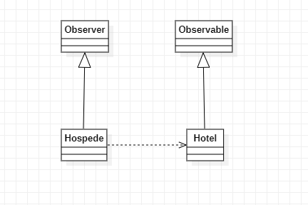

## 3. Padrões comportamentais:

---

### 3.7 Observer

### 3.7.1 Introdução

O Observer é um padrão de design comportamental que permite definir um mecanismo de assinatura para notificar vários objetos sobre quaisquer eventos que aconteçam com o objeto que eles estão observando.

### 3.7.2 Exemplo abordado
Para tal padrão de projeto, implementei um exemplo de uma manisfestação de interesse em determindado quarto em hotel

### 3.7.3 Diagrama de Classe do Exemplo

